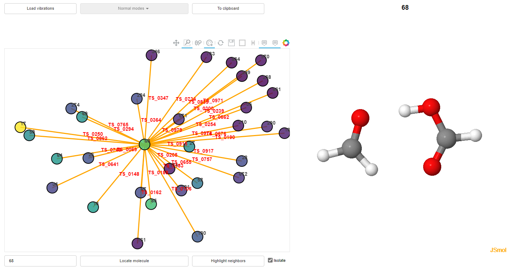

# Vizchemoton

This code reads a chemical reaction network generated with Chemoton[1], and generates and html file using
the amktools[2] in order to depict the reaction network.



## Dependencies

| Package              | Version |
|----------------------|---------|
| python               | 3.6.x   |
| amktools             | x.x.x   |
| nodejs               | 14.0.0  |
| scine-database       | 1.4.0   |
| scine-heron          | 1.0.0   |
| scine-molassembler   | 2.0.1   |
| scine-sparrow        | 5.1.0   |
| scine-utilities      | 9.0.0   |

## Instalation

```bash

# Create a conda enviroment
conda create --name my_env python=3.6
conda install -c conda-forge nodejs=14

# Clone this repository
git clone <this-repository>

# Install the visualization repository
git clone https://gitlab.com/dgarayr/amk_tools.git
pip install -e ./amk_tools/ 

# Install the reaction exploration repository
git clone https://github.com/qcscine/heron.git
pip install ./heron

# Run the code of this repository to obtain the html
python3 viz_chemoton.py ./reactions_epetrus_241010.csv ./compounds_epetrus_241010.txt

```

## References

1. a) Gregor N. Simm, Markus Reiher. *J. Chem. Theory Comput.* **2017**, 13, 12, 6108-6119.  b) Jan P. Unsleber, Stephanie A. Grimmel, Markus Reiher. *J. Chem. Theory Comput.* **2022**, 18, 9, 5393-5409
2. Diego Garay-Ruiz, Moises Alvarez-Moreno, Carles Bo, Emilio Martinez-Nunez. *ACS Phys. Chem Au* **2022**, 2, 3, 225-236.

