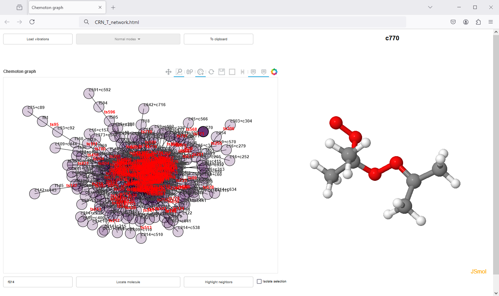

# VizChemoton - Visualization of Reaction Networks Generated with Chemoton

VizChemoton allows the **visualization of chemical reaction networks (CRNs)** constructed by [Chemoton](https://github.com/qcscine/chemoton) 
through the generation of standalone HTML files with [amk-tools](https://github.com/dgarayr/amk_tools), allowing the user to easily interact 
with the network **just via browser**.




*The image above shows which type of visualization (network on the left, structure on 
the right) the HTML file permits*


## Table of Contents

1. [Introduction to Chemoton](#introduction-to-chemoton)
2. [Introduction to amk-tools](#introduction-to-amk-tools)
3. [VizChemoton Code Overview](#vizchemoton-code-overview)
4. [Dependencies](#dependencies)
5. [Installation](#installation)
6. [Usage of the HTML Files](#usage-of-the-html-files)
7. [References](#references)
8. [Support and Contact](support-and-contact)

---

## 1. Introduction to Chemoton

The research group of Markus Reiher at ETH Zürich has developed the software enviroment [SCINE](https://github.com/qcscine) ("Software for 
Chemical Interaction Networks")[1] which pursues the performance of quantum chemical calculations with special focus
on algorithmic stability, automation, interactivity, efficiency and error control. In this context, Chemoton is the
SCINE module in charge of constructing CRNs in a fully automated fashion based on first-principles.[2] 

The reaction network results from Chemoton can be visualized with the graphical user interface developed in the same
SCINE framework, named [Heron](https://github.com/qcscine/heron).[3] This GUI has many functionalities beyond visualization, such as monitoring 
and steering the exploration, as well as creating json files to make the whole process reproducible. 

> Here we offer a complementary visualization tool aimed at providing an interactive visualization of the CRN without any previous dependencies. We highlight, however, that *VizChemoton* is just meant for creating a light-weight and convenient visualization format of the CRN, thus making it easily accessible to the scientific community.     


## 2. Introduction to amk-tools

The research group of Carles Bo at ICIQ (Tarragona, Spain) developed a library, named *amk-tools* allowing the 
reading, processing and visualizing the reaction networks[4] constructed by [AutoMeKin](https://github.com/emartineznunez/AutoMeKin), an automated reaction
discovery program developed by Emilio Martinez Nuñez (Galicia, Spain).[5] 


> Here we tailor the application of *amk-tools* to the visualization of CRNs constructed with *Chemoton*. 


## 3. VizChemoton Code Overview

In the following diagram we describe the modules that VizChemoton uses to generate the .html file.
The full workflow starts from querying the Mongo-DB *(1)* using the SCINE modules *(2)* to obtain the reactions
and compounds of the reaction network. Because querying the Mongo-DB might be a time-consuming step, we 
have enabled the option to export the network as a .json file, so that for future runs, the network can 
be directly imported *(a)*. The reaction and compounds data are also stored in a .csv and .json files respectively 
*(b)*. This allows importing the reaction and compound data without querying Mongo-DB nor the 
SCINE dependencies. To generate the visualization of the network, the amk-tools is called *(4)* which ultimately
writes the .html file *(5)*.

Notice that the chemical data present in the network.html can also be converted into pairs of input-ouput files
using [json2orca](https://github.com/gruberlopez/json2orca) *(c)* so that the data can be uploaded in the FAIR repository
[ioChem-BD](https://www.iochem-bd.org/) *(d)*. In section [5](#references) we show how network.html and data in 
ioChem-BD complement each other.


## 4. Dependencies

Dependencies are detailed in the requirements.txt file and in the table below.

| Package         | Version |
|-----------------|---------|
| python          | 3.6.x   |
| amktools        | 0.0.0   |
| ninja2          | 2.11.3  |
| scine-chemoton  | 3.1.0   |
| scine-database  | 1.3.0   |
| scine-sparrow   | 5.1.0   |
| scine-utilities | 8.0.0   |
| pyyaml          | 6.0.1   |
| network         | 2.5.1   |


## 5. Installation 

Here we provide a short installation guide for VizChemoton based on using an anaconda environment (e.g., my_env).

```bash

# Initialize conda
source $(conda info --base)/etc/profile.d/conda.sh

# Create the conda environment with Python 3.6
conda create --name my_env python=3.6

# Activate the conda environment
conda activate my_env

# Install Chemoton
git clone https://github.com/qcscine/chemoton.git
cd chemoton
git checkout 3.1.0
# make sure python3 from my_env is called
python3 -m pip install -r requirements.txt
python3 -m pip install .
cd ..

# Install amk-tools
git clone https://gitlab.com/dgarayr/amk_tools.git
cd amk_tools
python3 -m pip install -e .
cd ..

# Install VizChemoton
git clone https://github.com/petrusen/vizchemoton.git
cd vizchemoton
python3 -m pip install -r ./requirements.txt
python3 -m pip install .

```

## 6. Example

Before running the code, the user should edit the config.py to tailor the application of VizChemoton to the given 
specific system. Even so, the default config.yaml is set to that the user can run VizChemoton just out-of-the-box 
with the data in the *./vizchemoton/resources* folder. In the *.docs/manual.md* we provide a detailed explanation
of the parameters in config.py.

```bash

# Activate conda environment 
conda activate my_env

# Edit the config file
vi config.yaml

# Run the code of this repository (at the /vizchemoton level) to obtain the html
python3 -m viz_chemoton.py 

```

The code renders a .html file, with the path and name specified by the user, which contains the compounds and 
reactions of the reaction network. 

### 6.1 Usage of the HTML File

Double-clicking the .html file will open a dashboard similar to the diagram below, where we have 
depicted the description of the main built-in functionalities.


If the reader wishes to find a specific molecule in the network, we recommend using the Find module of 
[ioChem-BD](https://www.iochem-bd.org/). The diagram below shows the three steps: (1) select search by structure, (2) 
draw the chemical structure that you are interested in, (3) if Results is greater than 0 press the button go.
This will redirect you to the Browse module, where all the calculations involving the drawn structure will be listed. 
Next, you should search on the right-side of the screen the box named Author, and click the name Enric Petrus.
The Title name of the searched structure will be the same as the one in the network html file. 


## References

1. T. Weymuth, J. P. Unsleber, P. L. Türtscher, M. Steiner, J.-G. Sobez, C. H. Müller, M. Mörchen,
V. Klasovita, S. A. Grimmel, M. Eckhoff, K.-S. Csizi, F. Bosia, M. Bensberg, M. Reiher, *J. Chem. Phys.*, **2024**, *160*, 222501.
2. a) Gregor N. Simm, Markus Reiher. *J. Chem. Theory Comput.* **2017**, 13, 12, 6108-6119.  b) Jan P. Unsleber, Stephanie A. Grimmel, Markus Reiher. *J. Chem. Theory Comput.* **2022**, 18, 9, 5393-5409
3. C. H. Müller, M. Steiner, J. P. Unsleber, T. Weymuth, M. Bensberg, K.-S. Csizi, M. Mörchen, P. L. Türtscher, M. Reiher, *J. Phys. Chem. A*, **2024**, 128, 9028−9044.
(DOI: 10.48550/arXiv.2406.09541)
4. Diego Garay-Ruiz, Moises Alvarez-Moreno, Carles Bo, Emilio Martinez-Nunez. *ACS Phys. Chem Au* **2022**, 2, 3, 225-236.
5. E. Martínez-Núñez, G. L. Barnes, D. R. Glowacki, S. Kopec, D. Peláez, A. Rodríguez, R. Rodríguez-Fernández, R. J. Shannon, J. J. P. Stewart, P. G. Tahoces, S. A. Vazquez, *J. Comput. Chem.* **2021**, 42(28), 2036.

## Support and Contact

Should you find any problem or bug, please write a short message
to [enric.petrus@eawag.ch](enric.petrus@eawag.ch) 
